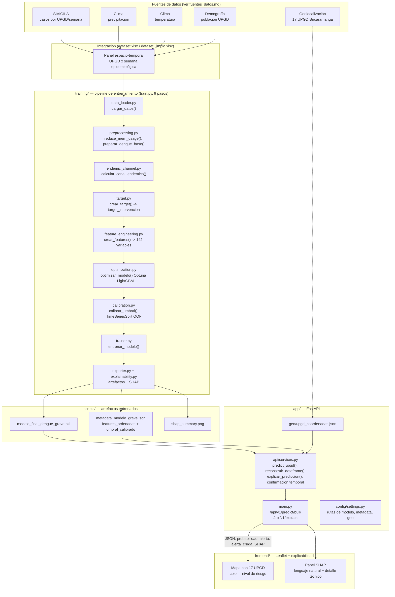

# Arquitectura del sistema

## Vista general

## Por qué estos límites de módulo

Cada archivo de `training/` tiene una única responsabilidad para que se pueda
reemplazar o depurar una etapa sin tocar las demás — por ejemplo, el
experimento de `calibration.py` (ampliar el rango de umbrales de 0.20-0.80 a
0.05-0.80) se hizo sin tocar
`optimization.py` ni `trainer.py`.

**Regla de imports del proyecto**: todo import interno es absoluto desde la
raíz (`from training.preprocessing import ...`, `from app.api.services import
...`), sin importar desde qué archivo se escriba — por eso `training/` y
`app/` necesitan su propio `__init__.py`.

## Flujo de una predicción en producción

1. El frontend pide `/api/v1/predict/bulk` con una lista de UPGD y una semana.
2. `services.reconstruir_dataframe()` busca la fila correspondiente en el
   panel histórico (con fuzzy matching de nombre de UPGD) y arma el vector de
   142 features en el orden exacto que espera el modelo
   (`features_ordenadas` en la metadata).
3. `predict_upgd()` calcula la probabilidad con el modelo LightGBM, aplica el
   umbral calibrado (0.12) y la **confirmación temporal** (exige que la semana
   actual y la anterior superen el umbral antes de emitir la alerta final).
4. `explicar_prediccion()` corre SHAP sobre esa fila puntual y traduce los
   factores top a lenguaje natural (`traducir_variable_inteligente()`) más un
   detalle técnico exacto, para servir tanto a comunidad como a
   epidemiólogos.
5. El frontend colorea el círculo de esa UPGD según el nivel de riesgo
   (0-25/26-50/51-75/76-100) y muestra un ícono ⚠ aparte, independiente del
   color, si la alerta confirmada está activa.

## Otros directorios

- `scripts_diagnostico/`: scripts sueltos de auditoría del target y del
  pipeline (`auditoria_target_base.py`, `diagnostico_retro.py`,
  `encontrar_semana.py`, `test_retro.py`), no forman parte de la ruta de
  producción — se usan manualmente para reproducir hallazgos puntuales
  documentados en `BITACORA_EXPERIMENTOS.txt`.

## Limpieza pendiente conocida

- `app/config/settings.py` define `BASELINE_PATH` apuntando a
  `scripts/baseline_features.json`, un archivo que no existe en el
  repositorio. `services.py` lo carga en el arranque (`cargar_json()`
  devuelve `{}` si no existe, así que no rompe nada) pero la variable
  `baseline` resultante nunca se vuelve a usar — o se genera ese artefacto,
  o se elimina la referencia muerta.

## Qué se necesitaría para escalar a otro municipio

El canal endémico (`endemic_channel.py`) y el contagio espacial
(`vecinos_alerta_prom`, calculado con distancias reales entre UPGD) están
calibrados sobre las 17 UPGD de Bucaramanga. Escalar a otra ciudad requeriría:
como mínimo 3 años de histórico SIVIGILA por institución para que el canal
endémico tenga referencia, y las coordenadas geográficas de las nuevas UPGD en
`app/geo/`. El resto del pipeline (feature engineering, modelo, calibración)
es agnóstico a la ciudad siempre que existan esos dos insumos.
